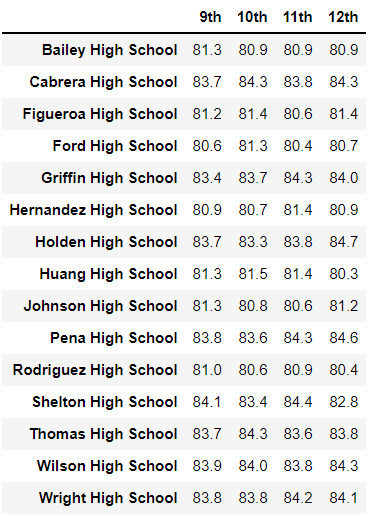

# School_District_Analysis

## Overview of the school district analysis:

The purpose of this analysis is to find out the school performance differences when the students' math and reading scores are changed to NaNs due to found academic dishonesty.

### Results:

- #### District Summary

​			

​					District Summary After changing 9th grade scores to NaN.

​					District Summary before changing 9th grade scores to NaN.

- #### School Summary

​							School Summary After changing 9th grade scores to NaN.

​							School Summary before changing 9th grade scores to NaN.

- #### Thomas High School Performance Difference by Replacing 9th Grade Scores

 							Thomas High School Summary After changing 9th grade scores to NaN.

​							Thomas High School Summary before changing 9th grade scores to NaN.

- #### The Effects of Replacing 9th Grade Scores

  - #### Math and reading scores by grade

    

    ​											Grade Math and Reading scores After changing 9th grade scores to NaN.

    

  

  ​													Grade Math and Reading scores before changing 9th grade scores to NaN.

  

  

  - #### Scores by school spending

  

  

  ​											School Spending Summary after changing 9th grade scores to NaN.

  

  

  ​											School Spending Summary before changing 9th grade scores to NaN.

  

  

  - #### Scores by school size

    

  

  ​											School Size Summary after changing 9th grade scores to NaN.

  

  

  ​												School Size Summary before changing 9th grade scores to NaN.

  

  

  - #### Scores by school type

​												School Type Summary after changing 9th grade scores to NaN.

​												School Type Summary before changing 9th grade scores to NaN.

### Summary:

We found four changes in the updated school district analysis after reading and math scores for the ninth grade at Thomas High School have been replaced with NaNs within the score precision of 0.1 and percentage precision of 1%.  They are the followings: school district average math score, Thomas High School math passing percentage,  Thomas High School reading passing percentage,  and Thomas High School overall passing percentage.

